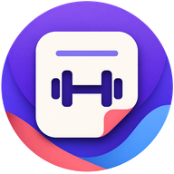
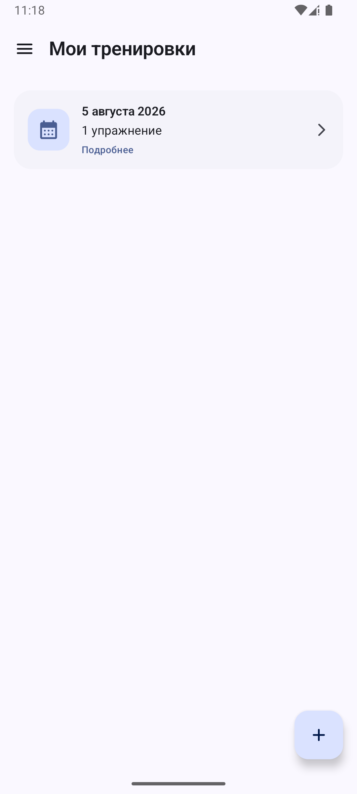
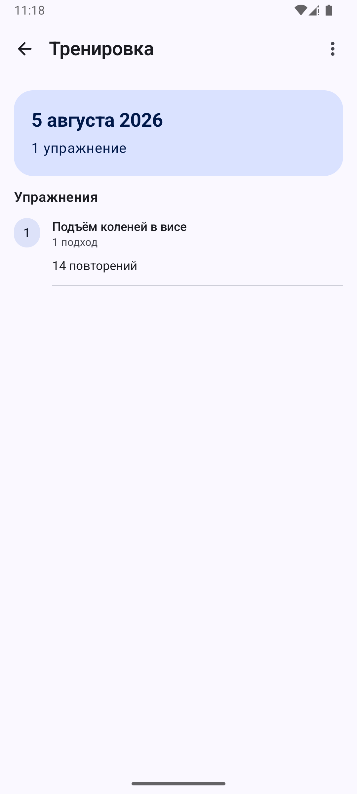
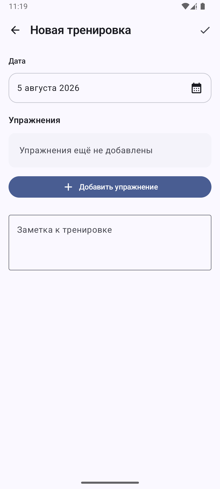

<p align="center">
  
</p>

<h1 align="center">DbWorkout</h1>

<p align="center">
  Личный офлайн-дневник тренировок для Android.<br>
  Все данные хранятся только на устройстве.
</p>

<p align="center">
  
  &nbsp;
  
  &nbsp;
  
</p>

## Возможности

- Тренировки, упражнения, подходы, повторения и вес
- История и календарь тренировок
- Свои упражнения и заметки
- Светлая и тёмная темы
- Полностью офлайн, без аккаунта и рекламы

## Технологии

Kotlin · Jetpack Compose · Material 3 · Room · DataStore

Минимальная версия — Android 8.0 (API 26).

## Сборка

```powershell
.\gradlew.bat :app:assembleDebug
```
